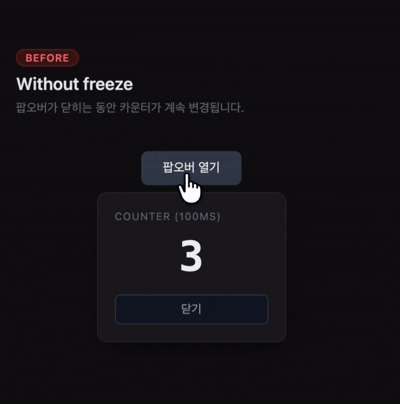
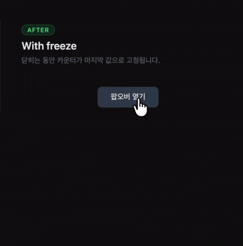

# freeze

> Freeze your React components during exit animations.

A React library that prevents content from changing inside components while they are animating out.

[한국어](./README.ko.md)

## Inspiration

Inspired by [Maxwell Barvian's "Bulletproof React Exit Animations"](https://barvian.me/react-exit-animations).

### The problem: content changes during exit animations

When a popover, modal, or drawer starts closing, React keeps processing state updates during the animation. This causes visible flicker — search placeholders change, selected items reorder, counters keep ticking — all while the component is fading out.

### The solution: "visible but frozen" components

The core idea is to repurpose React's **Suspense** mechanism. Suspense renders a subtree but prevents DOM commits — by throwing a never-resolving Promise, we force a component into a suspended state where the screen keeps showing the last committed snapshot.

Once the React team ships the **Activity API**, a native "visible but inactive" state will be available. Until then, this library provides a practical solution.

freeze offers two approaches:

1. **`useFreeze` hook** — delays unmounting with a timer and exposes a `frozen` flag so you can disable interactions during the exit. Sufficient for most cases.

2. **`Freeze` component** — uses React Suspense to block all DOM commits. The component keeps rendering but nothing reaches the screen.

## Demo

Run the demo app locally:

```bash
pnpm build
cd demo && pnpm install && pnpm dev
```

<table>
  <tr>
    <th>Without freeze — flicker</th>
    <th>With freeze — clean</th>
  </tr>
  <tr>
    <td></td>
    <td></td>
  </tr>
</table>

---

## Installation

```bash
npm install @jeonheonkim/freeze
# or
pnpm add @jeonheonkim/freeze
# or
yarn add @jeonheonkim/freeze
```

> Requires React 18 or later.

## API

### `useFreeze(isOpen, durationOrOptions?)`

Manages the render lifecycle of a component during exit animations.

```ts
// Simple — fixed duration
const { shouldRender, frozen } = useFreeze(isOpen, 300);

// Options object — with callback
const { shouldRender, frozen } = useFreeze(isOpen, {
  duration: 300,
  onExitComplete: () => console.log('exit done'),
});

// Ref-based — auto-detect animation/transition end
const ref = useRef<HTMLDivElement>(null);
const { shouldRender, frozen } = useFreeze(isOpen, {
  ref,
  onExitComplete: () => console.log('exit done'),
});
```

**Parameters:**

| Parameter | Type | Default | Description |
|-----------|------|---------|-------------|
| `isOpen` | `boolean` | — | Open/close state of the component |
| `durationOrOptions` | `number \| UseFreezeOptions` | `300` | Exit duration in ms, or an options object |

**`UseFreezeOptions`:**

| Property | Type | Default | Description |
|----------|------|---------|-------------|
| `duration` | `number` | `300` | Exit animation duration in ms (max 10000) |
| `onExitComplete` | `() => void` | — | Called after exit animation finishes and the component unmounts |
| `ref` | `RefObject<HTMLElement \| null>` | — | Element ref for auto-detecting `transitionend` / `animationend`. When provided, `duration` is ignored (falls back to `duration` if `ref.current` is `null`). A safety timeout of 10s fires if no event is detected. |

**Returns (`UseFreezeReturn`):**

| Property | Type | Description |
|----------|------|-------------|
| `shouldRender` | `boolean` | Whether the component should be in the DOM |
| `frozen` | `boolean` | Whether the component is currently frozen |

### `<Freeze frozen={boolean}>`

Blocks all DOM commits to children using React Suspense.

```tsx
<Freeze frozen={frozen}>
  <div>This content will not update on screen while frozen=true</div>
</Freeze>
```

**Props (`FreezeProps`):**

| Prop | Type | Description |
|------|------|-------------|
| `frozen` | `boolean` | When `true`, blocks DOM commits to children |
| `children` | `ReactNode` | Content to render |

### TypeScript

All types are exported:

```ts
import type { FreezeProps, UseFreezeOptions, UseFreezeReturn } from '@jeonheonkim/freeze';
```

## Usage

### Basic usage (useFreeze only)

`useFreeze` alone is enough for most cases.

```tsx
import { useFreeze } from '@jeonheonkim/freeze';

function Modal({ isOpen }: { isOpen: boolean }) {
  const { shouldRender, frozen } = useFreeze(isOpen, 300);

  if (!shouldRender) return null;

  return (
    <div
      className={isOpen ? 'modal-enter' : 'modal-exit'}
      style={{ pointerEvents: frozen ? 'none' : 'auto' }}
    >
      <p>Modal Content</p>
    </div>
  );
}
```

### With `onExitComplete` callback

Run cleanup logic after the exit animation finishes.

```tsx
import { useFreeze } from '@jeonheonkim/freeze';

function Drawer({ isOpen, onClose }: { isOpen: boolean; onClose: () => void }) {
  const { shouldRender, frozen } = useFreeze(isOpen, {
    duration: 400,
    onExitComplete: () => onClose(),
  });

  if (!shouldRender) return null;

  return (
    <div
      className={isOpen ? 'drawer-enter' : 'drawer-exit'}
      style={{ pointerEvents: frozen ? 'none' : 'auto' }}
    >
      <p>Drawer Content</p>
    </div>
  );
}
```

### Ref-based event detection

Let the browser tell you when the CSS animation/transition ends — no need to hardcode `duration`.

```tsx
import { useRef } from 'react';
import { useFreeze } from '@jeonheonkim/freeze';

function Tooltip({ isOpen }: { isOpen: boolean }) {
  const ref = useRef<HTMLDivElement>(null);
  const { shouldRender, frozen } = useFreeze(isOpen, { ref });

  if (!shouldRender) return null;

  return (
    <div
      ref={ref}
      className={isOpen ? 'tooltip-enter' : 'tooltip-exit'}
      style={{ pointerEvents: frozen ? 'none' : 'auto' }}
    >
      <p>Tooltip Content</p>
    </div>
  );
}
```

### Suspense-based (useFreeze + Freeze)

Use the `Freeze` component when you need to completely block DOM updates.

```tsx
import { Freeze, useFreeze } from '@jeonheonkim/freeze';

function Popover({ isOpen }: { isOpen: boolean }) {
  const { shouldRender, frozen } = useFreeze(isOpen, { duration: 200 });

  if (!shouldRender) return null;

  return (
    <Freeze frozen={frozen}>
      <div className={isOpen ? 'popover-enter' : 'popover-exit'}>
        <SearchInput />
        <ItemList />
      </div>
    </Freeze>
  );
}
```

## License

MIT
